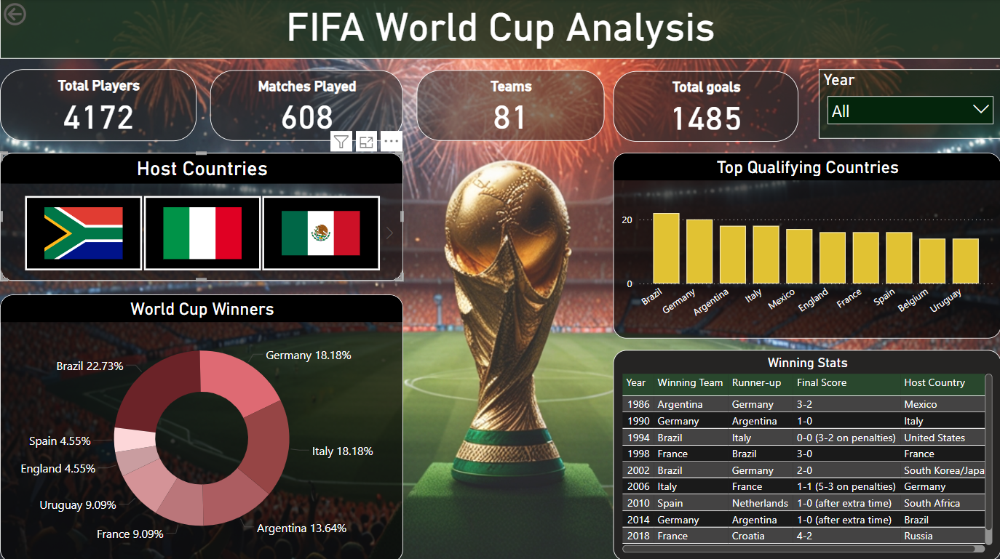

# FIFA-WorldCup-Analysis

## Overview
This project aims to analyze the FIFA World Cup from 1986 to 2022, uncovering key trends, performances, and unique moments to provide valuable insights. Our team of five members conducted this analysis as a collaborative project.

## Table of Contents
- [Project Objective](#project-description)
- [Project Approach](#project-description)
- [Tech Stack](#tech-stack)
- [Dashboard Overview](#dashboard-overview)
- [Video Presentation link](#video-presentation-link)
- [Project PPT link](#demo-link)

- ## Project Objective
The goal of this project is to provide a comprehensive analysis of the FIFA World Cup tournaments from 1986 to 2022. This report aims to highlight key insights, trends, and patterns related to the host countries, winning and runner-up teams, top scorers, and their goals, along with other significant metrics over the years. 

## Tech Stack
- *Excel*: For data collection and preparation.
- *Python*: For data cleaning, manipulation, and generating insights (EDA).
- *Power BI*: For creating the final interactive dashboard.

- ## Dashboard Overview

These dashboards provide a comprehensive overview, match insights, and detailed player analysis of the FIFA World Cup from 1986 to 2022:

#### Overview of the FIFA World Cup Analysis
- Total Players, Matches, Teams, and Goals: Displays key statistics, including 4,172 players, 608 matches played, 81 teams, and 1,485 total goals.
- Host Countries: A slider showing countries that have hosted the World Cup.
- World Cup Winners: A donut chart displaying the percentage of wins by countries, with Brazil (22.73%), Germany (18.18%), and Italy (18.18%) as the top three.
- Top Qualifying Countries: A bar chart highlighting the countries that qualified most frequently, such as Brazil, Germany, and Argentina.
- Winning Stats: A table with detailed winning statistics, including the winning team, runner-up, final score, and host country from 1986 to 2022.

- #### Match Insights
- Team Performance in Knock-out & Group Stage: A bar chart illustrating the performance of top teams like Argentina, Brazil, and England in group and knockout stages.
- World Cup Scores by Venue: A bar chart of scores across different stadiums.
- Match Insights by Country: A world map visualization highlighting insights by different countries.
- Home & Away Team Stats: A table displaying match stats categorized by month, day, home team, and away team.
- Most Popular Venues: A bar chart ranking the most popular venues by attendance, with Estadio Azteca and Lusail Iconic Stadium as top sites.

#### Player Details
- Total Players: Reiterates the total number of players (4,172).
- Player Foot Preference: A donut chart shows that 92.48% of players are right footed, while 7.52% are left footed.
- Count of Players by Club: A bar chart with the top 10 clubs by the number of players, such as Real Madrid and Atlético Madrid having the high number of players.
- Count of Players by Position: A bar chart categorizing players by position, with Midfielders, Defenders, and Forwards as the top positions.
- Performance Analysis by Height and Weight: Scatter plots analyzing player performance by height and weight.
- Performance Analysis by Preferred Foot: A scatter plot assessing player performance based on their preferred foot.

## Video Presentation Link
[Youtube-Link](https://youtu.be/8mieMpBjuEM)

## Project PPT Link
[PPT-Link](https://drive.google.com/file/d/1vjk3LBHjvVVtug7MvZP723Qi9SIC5I48/view?usp=sharing)

